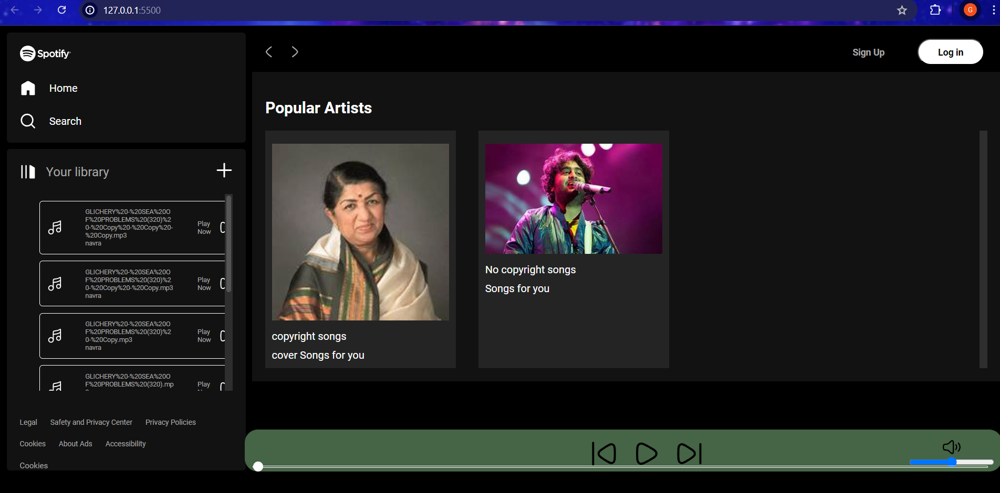
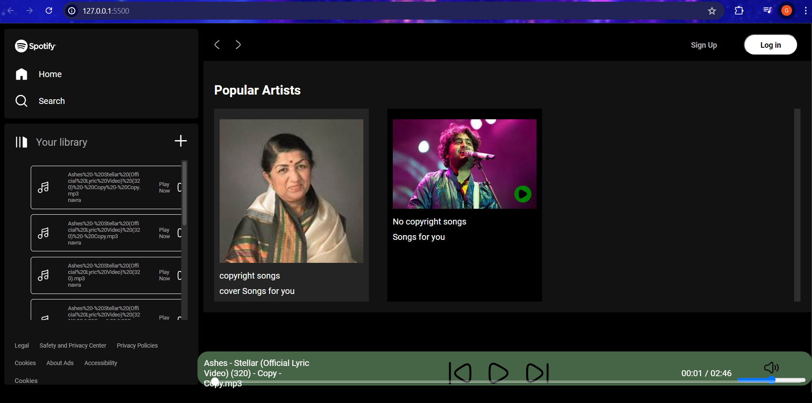
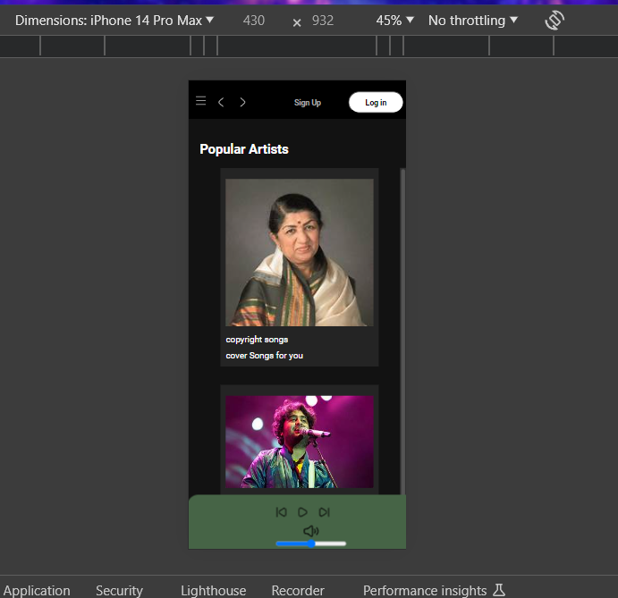
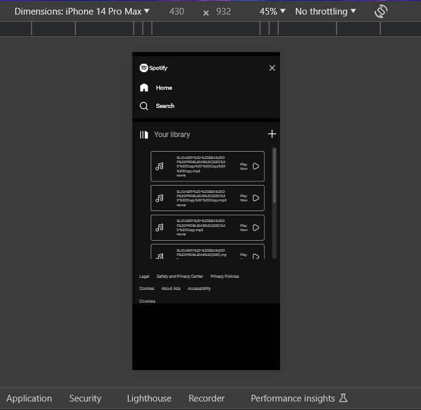
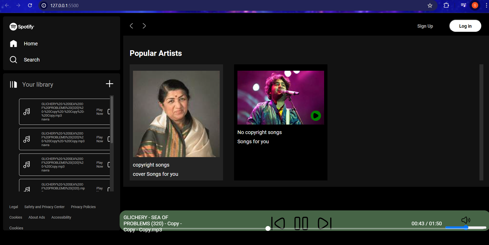
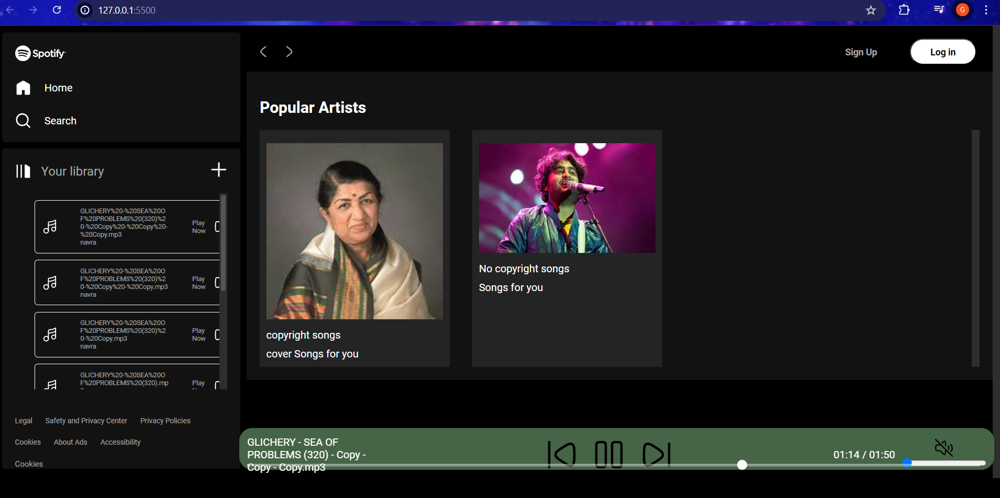

```
This is a project I have worked on with the aim of developing my Javascript skills. It is a music player whose UI inspiration is taken from Spotify. 
```



```
It fetches the songs and loads the playlists dynamically from the local storage of my device. On clicking on a playlist, it loads the songs of that playlist which can be viewed and played from 'Your library' section.
```



```
It is fully responsive, I have provided a hamburger functionlity for phone/tablet users. On clicking on hamburger icon, it loads the left part including library section.
```





```
I have also provided a playbar with various functionalities such as play/pause music, previous/next song in library, mute/unmute options and volume rocker. It also has a seekbar which can play from a specific timestamp on clicking on it.
```



