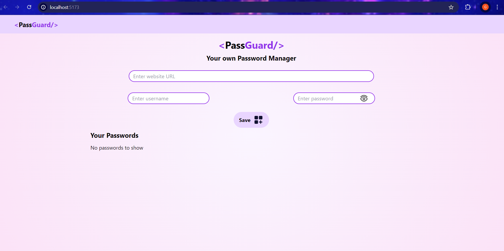
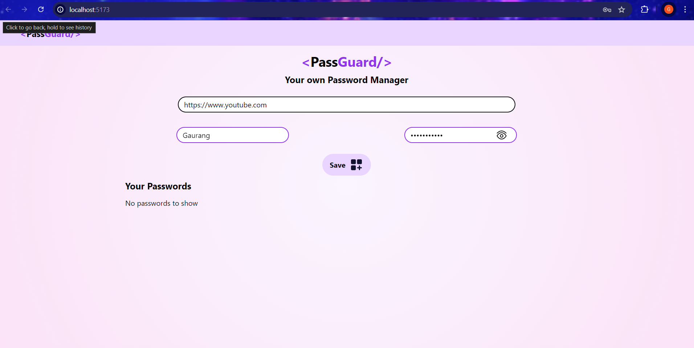
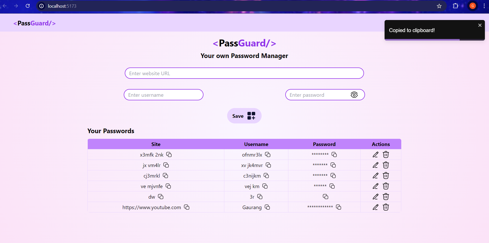
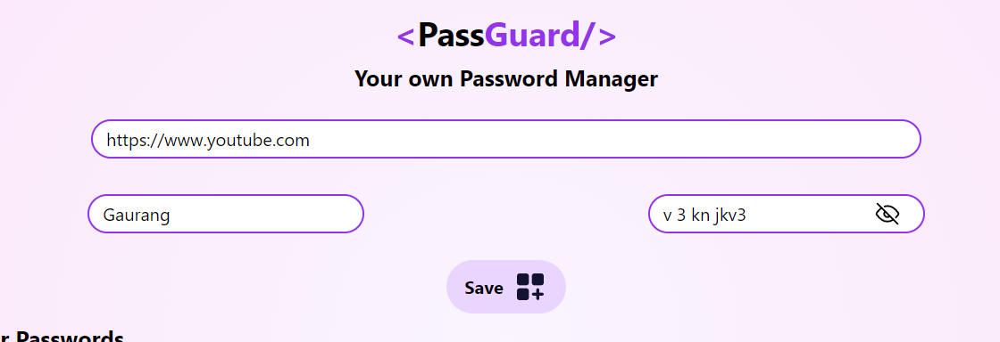
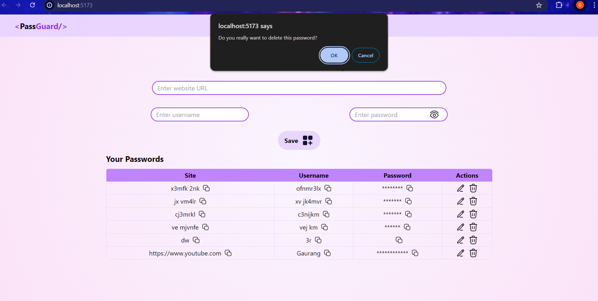
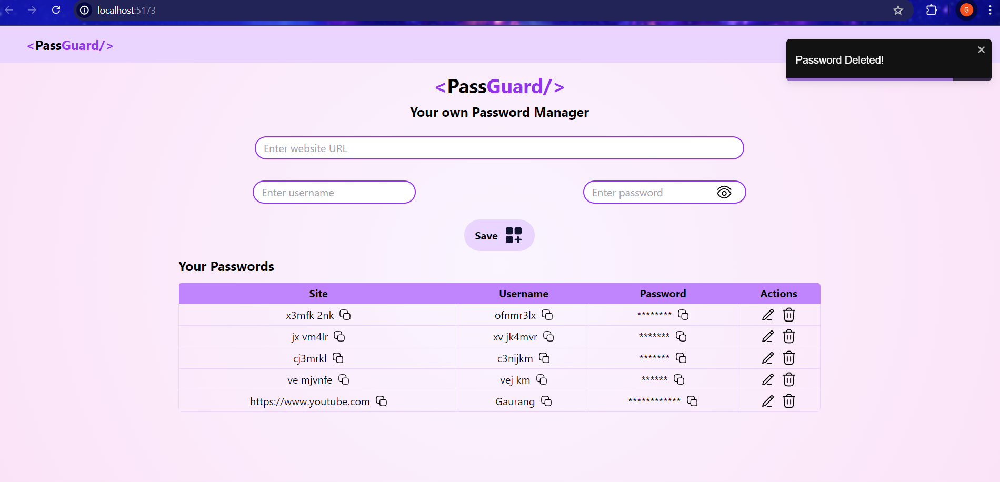

```
After practicing React and learning Node, Express and MongoDB, this is my first full stack MERN project.
```



```
It is a password manager project which efficiently manages user's passwords. For frontend I have used React with react-toastify to raise toasts, uuid to generate unique ids, and vite as the development tool. 
```

```
User can add the website URL, username and password and click on save to save a password. Copy buttons have been provided to copy the entry in the clipboard.
```





```
Eye icon is provided near password input to hide/view password before saving.
```



```
Edit and delete icons can be used to edit and delete passwords from database.
```






```
For backend I have created an express app and used body parser, dotenv and cors node packages. I have created GET, POST and DELETE APIs for retrieving existing data in DB, saving a new password in DB, and deleting a password from DB respectively. I have succeessfully tested them using Postman. I have also used mongodb npm package for interaction with DB.  
```
