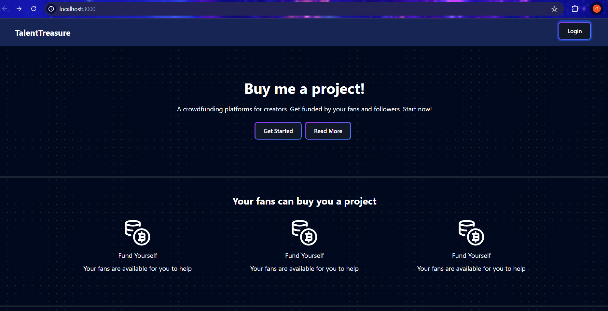
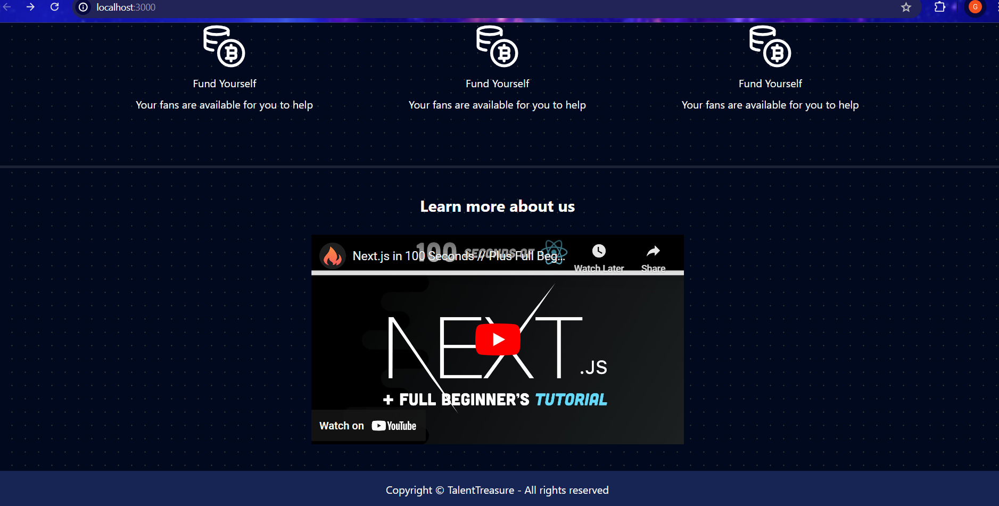
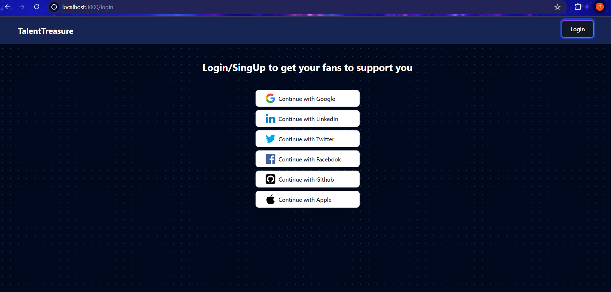
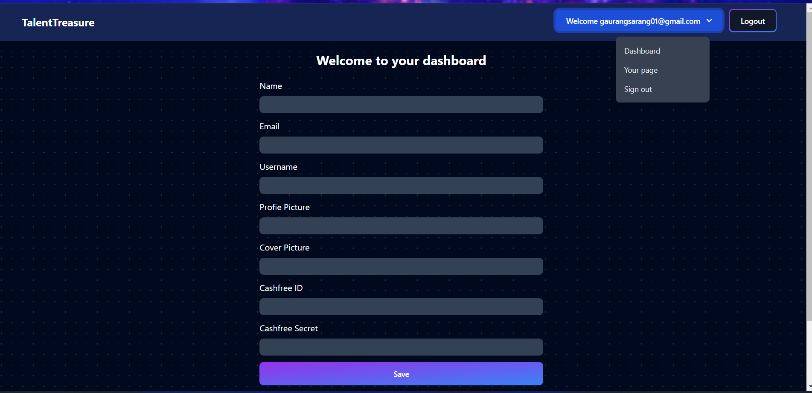
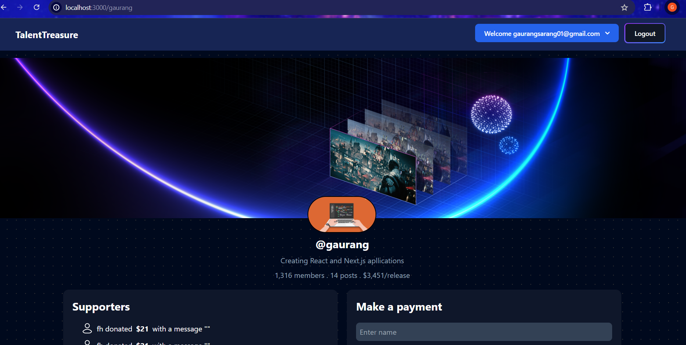
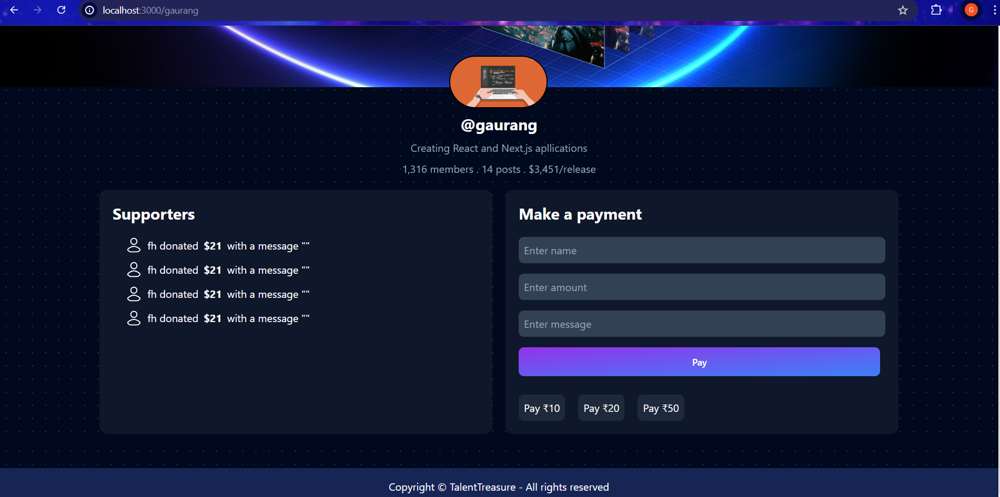

```
This is the current project that I am working on in which I am using Next.js which allows creators to recieve funds from their followers which increases their reach.
```





```
I have used file based routing for Get started, Read more, Login and dashboard pages. Login button allows users to login via various platforms. I have used Github provider of next-auth.js for login and authentication. Various functionalities of an active session are created using next-auth.
```



```
After signing in with github, it loads a dashboard to enter the required details which are stored in the database.
```



```
The dropdown after login allows users to navigate to different pages and allows sign out using sign out dropdown or a separate logout button. It also allows the user to navigate to their respective pages.
```

```
I am currently working on the payment page and integrating a payment gateway. Followers can enter their name, amount and a message which will be displayed on the Supporters list if the payment is successfull.
```





```
I have created User and Payment models which have details about User and Payment. I have used Mongoose to interact with the MongoDb database.
```

```
I will complete this project within a few days by incorporating the paymnet gateway of Cashfree paymnets using Test mode API keys for payment functionality, working on the remaining pages and then make some UI changes. I then plan to host it. 
```