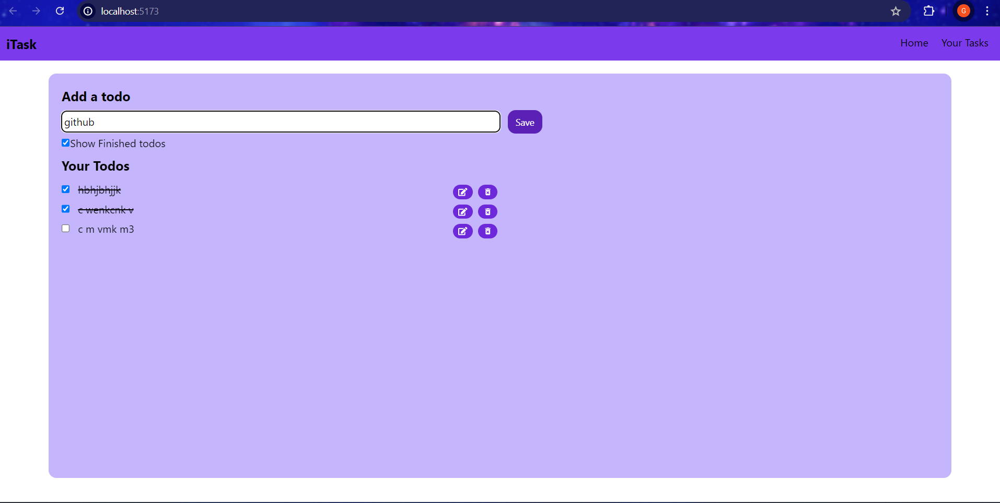

```
This is the first React project which I have made to get hands on with React. I have used uuid to generate unique ids, react icons for icons and vite as development tool.  
```


```
It is a todo list which allows users to add a todo and save it in the browser's local storage.
```



```
Users can check finished tasks which crosses it and and choose whether to show finsihed tasks or not.
```


```
Users can also delete a task and edit a task by clicking on their respective icons.
```